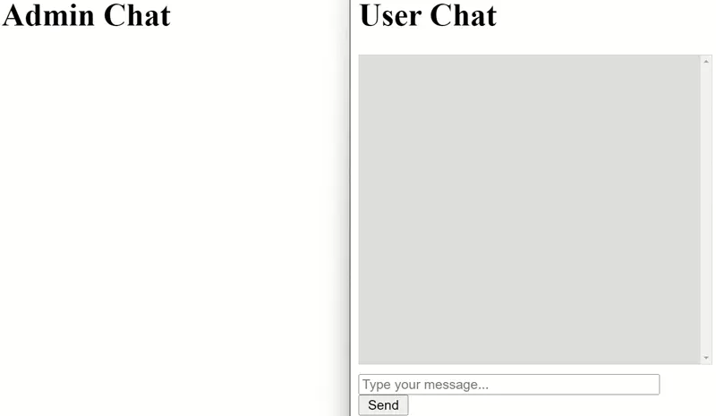

# Livechat WebSocket

This project demonstrates the use of WebSocket to create a real-time live chat application allowing communication between users and an admin. The admin can chat with multiple users simultaneously.

## Running the WebSocket Server

### For Debugging:

To start the WebSocket server in debugging mode, use the following command:

```sh
npm start
```

### For Production:

To run the WebSocket server in production mode, use the following command:

```sh
npm run production
```

## Testing the Live Chat

### As a User:

Open the following URL in your browser to start a chat session as a user:

```
http://localhost:5000/user.html
```

### As an Admin:

Open the following URL in a different browser or an incognito window to manage chats as an admin:

```
http://localhost:5000/admin.html
```
## Functionality Demo

